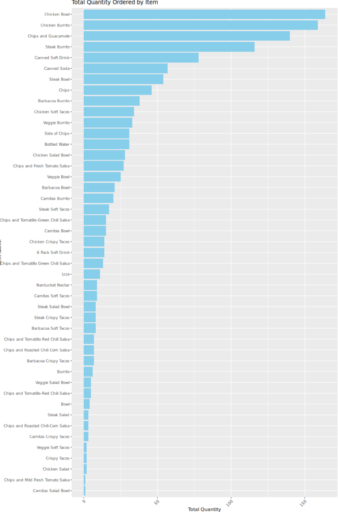

import OutputDisplay from '../../components/OutputDisplay.astro'

## Introduction to Chipotle Order Analysis

Hey data enthusiasts! Today, we're diving into a tasty dataset: Chipotle orders. We'll use R to analyze order quantities, visualize our findings, and uncover some interesting patterns. This tutorial is perfect for those looking to spice up their R skills with some real-world data. Let's dig in!

## Setting Up Our Environment

First, let's make sure we have the tools we need:

```r
if (!require(ggplot2)) install.packages("ggplot2")
library(ggplot2)
```

What's happening here?

- We check if the `ggplot2` package is installed. If not, we install it.
- We then load the `ggplot2` library, which we'll use for visualization.

## Loading and Peeking at Our Data

Now, let's load our Chipotle order data and take a quick look. Feel free to explore the raw data here: [https://raw.githubusercontent.com/towardsuffering/data/main/orders.csv](https://raw.githubusercontent.com/towardsuffering/data/main/orders.csv).

```r
rm(list=ls())  # Clear the environment
chipotleOrders <- read.csv("https://raw.githubusercontent.com/towardsuffering/data/main/orders.csv", stringsAsFactors=FALSE)
head(chipotleOrders)head(chipotleOrders)
```

<OutputDisplay>
	cust_id quantity item_name 1 1 1 Chips and Fresh Tomato Salsa 2 1 1 Izze 3 1 1 Nantucket Nectar 4
	1 1 Chips and Tomatillo-Green Chili Salsa 5 2 2 Chicken Bowl 6 3 1 Chicken Bowl choice_description
	item_price 1 NULL $2.39 2 [Clementine] $3.39 3 [Apple] $3.39 4 NULL $2.39 5 [Tomatillo-Red Chili
	Salsa (Hot), [Black Beans, Rice, Cheese, Sour ... $16.98 6 [Fresh Tomato Salsa (Mild), [Rice,
	Cheese, Sour Cream, Guacamole, ... $10.98
</OutputDisplay>

What's happening here?

- We clear our R environment to start fresh.
- We read our CSV file into a data frame called `chipotleOrders`.
- `head()` shows us the first few rows of our data.

## Aggregating Data by Item Name

Let's sum up the quantities for each item:

```r
qtyDF <- aggregate(quantity ~ item_name, FUN=sum, data=chipotleOrders)
head(qtyDF)
```

<OutputDisplay>

                  item_name quantity

1 6 Pack Soft Drink 55
2 Barbacoa Bowl 66
3 Barbacoa Burrito 91
4 Barbacoa Crispy Tacos 12
5 Barbacoa Soft Tacos 25
6 Bottled Water 162

</OutputDisplay>

What's happening here?

- We use `aggregate()` to sum up the quantities for each unique item name.
- The result is stored in `qtyDF`, a new data frame with item names and their total quantities.

## Visualizing Item Quantities

Now, let's create a bar plot of our data:

```r
ggplot(qtyDF, aes(x=reorder(item_name, -quantity), y=quantity)) +
  geom_bar(stat="identity", fill="skyblue") +
  theme(axis.text.x = element_text(angle = 45, hjust = 1)) +
  labs(title="Total Quantity Ordered by Item",
       x="Item Name",
       y="Total Quantity") +
  coord_flip()
```



What's happening here?

- We use `ggplot2` to create a bar plot.
- `reorder(item_name, -quantity)` sorts items by quantity in descending order.
- `geom_bar(stat="identity")` creates bars with heights equal to the quantity values.
- We rotate x-axis labels for better readability.
- `coord_flip()` turns this into a horizontal bar chart for easier reading of item names.

## Examining Raw Data

Let's look at our raw data:

```r
qtyDF$item_name
qtyDF$quantity
sort(qtyDF$quantity, decreasing=FALSE)
```

<OutputDisplay>

[1] "6 Pack Soft Drink" "Barbacoa Bowl" "Barbacoa Burrito"  
[4] "Barbacoa Crispy Tacos" "Barbacoa Soft Tacos" "Bottled Water"

[1] 55 66 91 12 25 162 ...

[1] 1 2 3 5 7 9 12 25 28 29 30 32 35 39
[15] 44 50 54 55 57 66 68 85 91 106 110 117 126 146
[29] 162 211 304 523 726 726 761 1000 1054 1522

</OutputDisplay>

What's happening here?

- We print out the item names and their quantities separately.
- We then sort the quantities in ascending order to see the range of values.

## Conclusion

And there you have it! We've taken a deep dive into Chipotle order data using R. From loading and aggregating data to creating insightful visualizations, we've covered some essential data analysis techniques.

These skills are applicable far beyond just Chipotle orders - you can use similar methods to analyze all sorts of datasets in your data science journey.

## Next Steps

Ready to take your R skills to the next level? Try these:

1. Analyze the most popular combination of items in an order.
2. Calculate the average order value and visualize it over time.
3. Investigate if there's a correlation between certain items being ordered together.

Keep crunching those numbers, and happy coding!
