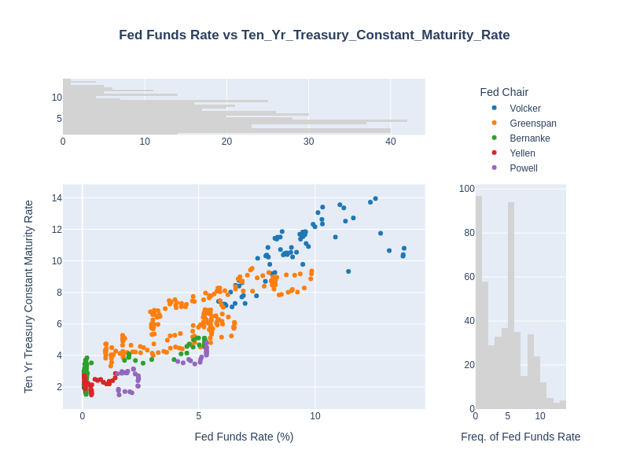
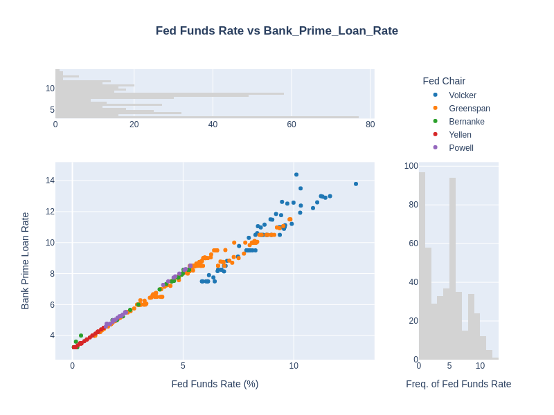
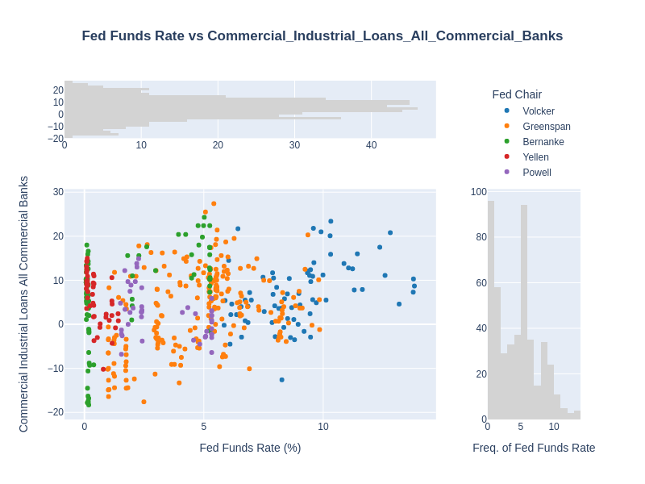
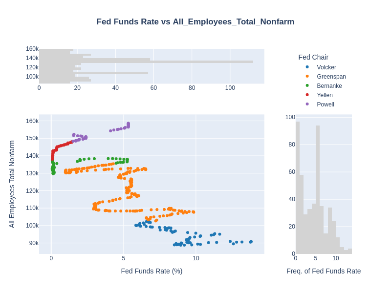
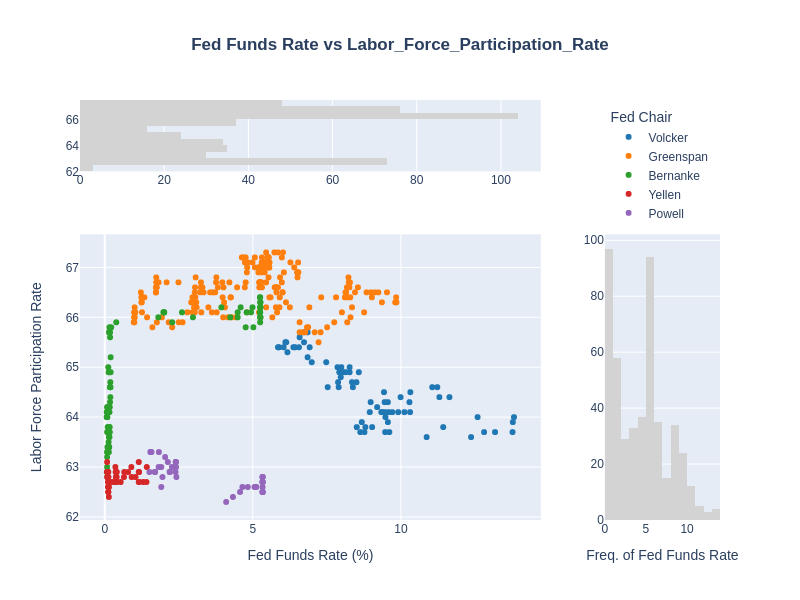
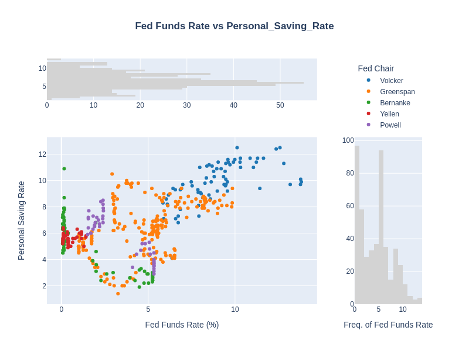
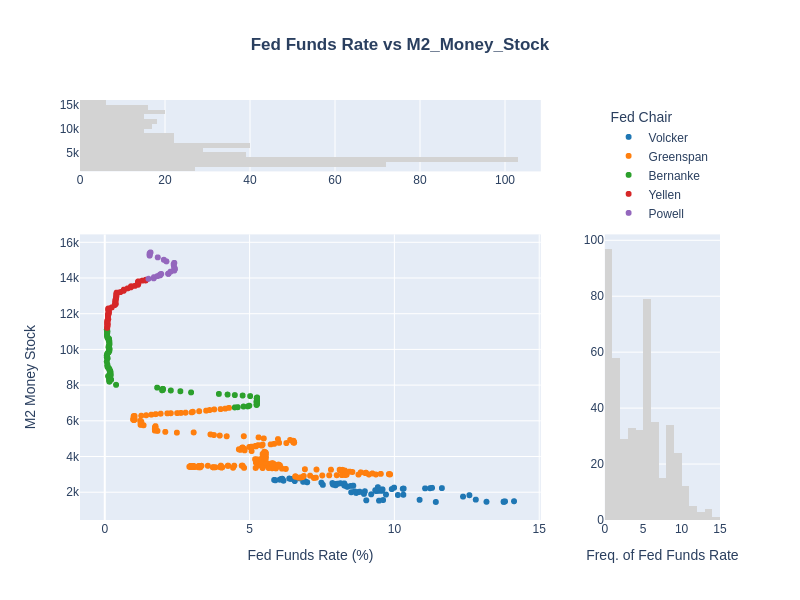
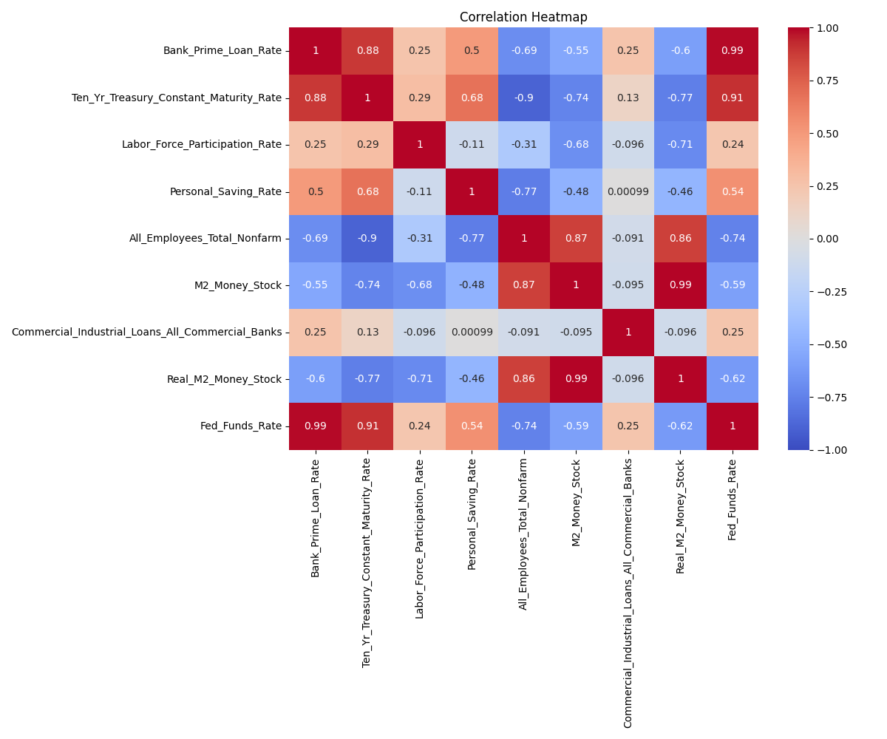

The U.S. economy’s relationship with the Federal Reserve has always been a delicate balance between short-term policy adjustments and long-term economic stability. The Fed’s decisions on interest rates have wide-reaching effects, influencing not only domestic growth, inflation, and employment, but also global markets and capital flows. With the recent rate cut in September 2024—the first in four years—we are entering a new phase of economic recalibration. To fully grasp the implications, it helps to revisit key moments in the Fed’s history and examine how its policies have shaped both the U.S. economy and the global financial landscape.

## A Brief Historical Timeline of Fed Policy

- **1979-1987: Paul Volcker’s Battle Against Inflation**  
  Volcker’s decision to raise the Federal Funds Rate to unprecedented highs—at times exceeding 20%—was a bold, controversial move aimed at crushing runaway inflation. The immediate impact was painful, triggering back-to-back recessions, but it laid the groundwork for long-term economic stability and set the stage for the growth that followed.

- **1987-2006: Alan Greenspan’s Market-Driven Approach**  
  Greenspan’s tenure was characterized by low and stable interest rates, which fostered sustained growth but also contributed to speculative bubbles. The dot-com and housing market bubbles were byproducts of this extended period of easy credit, illustrating how short-term policy decisions can have long-term unintended consequences. His post-dot-com interest rate cuts were a precursor to the 2008 financial crisis, demonstrating the cyclical nature of boom-and-bust dynamics.

- **2006-2014: Ben Bernanke and the Era of Quantitative Easing**  
  Bernanke’s response to the Great Recession was nothing short of revolutionary. By slashing interest rates to near zero and employing quantitative easing, Bernanke fundamentally reshaped the role of central banks in modern economies. The global implications of these policies were profound, impacting capital flows, exchange rates, and international trade, signaling a shift toward more aggressive interventionist strategies.

- **2014-2018: Janet Yellen’s Balancing Act**  
  Yellen focused on a gradual approach to normalizing rates after years of ultra-loose monetary policy. Her methodical rate hikes were intended to prevent economic overheating while maintaining steady growth. Her tenure reinforced the idea that sustainable economic policy is not about short-term gains, but about fostering resilience over the long term.

- **2018-Present: Jerome Powell’s Crisis Management**  
  Powell’s leadership has been defined by a dual challenge: navigating a strong pre-pandemic economy and responding to the unprecedented shock of COVID-19. His aggressive rate cuts in 2020 and massive liquidity injections reshaped not only U.S. monetary policy but also global financial markets. As we enter this new cycle of easing with the September 2024 rate cut, the question remains: How will the Fed balance the immediate needs of the economy with long-term global stability?

To fully grasp the broader implications of the Fed's decisions, it's essential to look beyond individual tenures and understand how these policies interact with the underlying mechanisms of the economy. From interest rates and bond yields to liquidity flows and savings behavior, each decision reverberates across markets, shaping consumer and corporate actions. In this analysis, data is sourced from the Federal Reserve Economic Data (FRED) on a monthly timescale, which allows for a more granular look at key indicators like interest rates and money supply. However, major indicators like GDP and inflation, which are reported quarterly, are not included. By focusing on monthly data, we can better capture the short- to medium-term effects of monetary policy on different aspects of the economy. Let’s explore how these key factors come into play.

## The Fed's Influence: A Data-Driven Narrative

### 1. Fed Funds Rate and Treasury Yields

The chart illustrates the relationship between the `Fed Funds Rate and the Ten-Year Treasury Constant Maturity Rate`. Note the frequency distributions at the top and right side of the main plot:

- The top distribution shows the frequency of different 10-Year Treasury Constant Maturity Rates.
- The right-side distribution shows the frequency of different Fed Funds Rates.

The main scatter plot reveals a strong positive correlation between these two rates. As the Fed Funds Rate increases, we generally see a corresponding rise in the 10-year Treasury yield.

Notably, the frequency distribution of the Fed Funds Rate (right side) shows a bimodal pattern, with peaks around 0-2% and 5-6%. This suggests two distinct monetary policy regimes: one of low rates (likely during economic downturns or low inflationary periods) and another of moderate rates (during periods of economic expansion or higher inflation).

The tight coupling between short-term policy rates and long-term yields underscores the Fed's significant influence on the entire yield curve. However, periods of divergence, particularly during the Greenspan era, hint at times when market expectations differed from Fed policy, possibly due to changing inflation expectations or global economic factors.

### 2. The Ripple Effect on Lending

This chart shows the relationship between the `Fed Funds Rate and the Bank Prime Loan Rate`. The frequency distributions are as follows:

- Top: Distribution of Bank Prime Loan Rates
- Right: Distribution of Fed Funds Rates

The relationship between these rates is nearly linear, demonstrating the direct transmission of monetary policy to commercial lending rates.

The frequency chart for the Fed Funds Rate (right side) shows a wide distribution, indicating the Fed's willingness to use a broad range of rates to manage economic conditions. The clustering at lower rates in recent years reflects the prolonged period of accommodative monetary policy following the 2008 financial crisis.

This tight correlation suggests that changes in the Fed Funds Rate quickly impact borrowing costs across the economy, affecting everything from mortgage rates to business loans. The immediate pass-through to prime rates underscores the potency of Fed policy in influencing credit conditions and, by extension, economic activity.

### 3. Impact on Commercial and Industrial Activity

This chart depicts the relationship between the `Fed Funds Rate and Commercial and Industrial Loans`. The frequency distributions are:

- Top: Distribution of Commercial and Industrial Loans
- Right: Distribution of Fed Funds Rates

The relationship between the Fed Funds Rate and Commercial and Industrial Loans presents a more complex picture. Unlike the linear relationship with prime rates, loan activity shows varying responses to interest rate changes across different Fed chair tenures.

The frequency distribution of loan activity (top) is relatively uniform, suggesting that factors beyond just the interest rate significantly influence lending. This could include business confidence, regulatory environment, and overall economic conditions.

Interestingly, we see periods of increased lending activity even during times of rising rates, particularly during the Greenspan era. This counter-intuitive relationship highlights the importance of considering broader economic contexts when interpreting the impact of monetary policy on real economic activity.

### 4. The Labor Market's Reaction

This chart compares the `Fed Funds Rate to Total Nonfarm Employment`. The frequency distributions are:

- Top: Distribution of Total Nonfarm Employment
- Right: Distribution of Fed Funds Rates

The main scatter plot reveals an intricate relationship between these two variables. Generally, periods of lower rates correspond with increasing employment, while rate hikes often precede employment downturns.

The frequency chart for employment (top) shows a gradual upward trend over time, reflecting long-term economic growth. However, sharp drops coincide with recessions, notably during the Volcker era and the 2008 financial crisis.

The Fed Funds Rate distribution (right) illustrates the range of monetary policy stances over time, from near-zero rates to high-interest environments.

This relationship underscores the Fed's challenging dual mandate. While lower rates can stimulate employment, the lagged effect of policy changes and the influence of broader economic cycles complicate this relationship. The chart also hints at the potential long-term consequences of prolonged low-rate environments, as seen in the rapid employment growth during the Greenspan era.

### 5. A Deeper Look at Labor Force Dynamics

This chart illustrates the relationship between the `Fed Funds Rate and the Labor Force Participation Rate`. The frequency distributions are:

- Top: Distribution of Labor Force Participation Rates
- Right: Distribution of Fed Funds Rates

The relationship between these variables is less straightforward than with overall employment. This chart reveals the limitations of monetary policy in influencing structural aspects of the labor market.

The frequency distribution of participation rates (top) shows a notable decline in recent years, a trend that persists despite varying interest rate environments. This suggests that factors such as demographic shifts, technological change, and social policies may have a more significant impact on participation rates than monetary policy alone.

The Fed Funds Rate distribution (right) again shows the range of monetary policy stances, emphasizing the varying rate environments that have coexisted with changing labor force participation trends.

The complex relationship displayed here emphasizes the need for a multifaceted approach to labor market challenges, combining monetary policy with targeted fiscal and social policies.

### 6. The Savings Conundrum

This chart depicts the `Fed Funds Rate versus the Personal Saving Rate`. The frequency distributions are:

- Top: Distribution of Personal Saving Rates
- Right: Distribution of Fed Funds Rates

The scatter plot reveals a nuanced relationship between these variables. Contrary to what traditional economic theory might suggest, we don't always see a clear positive correlation between interest rates and savings rates.

The frequency distribution of savings rates (top) shows significant variability, with notable spikes during economic crises (as seen in the Bernanke and Powell eras). This suggests that factors such as economic uncertainty and income shocks can have a more immediate impact on savings behavior than interest rates alone.

The Fed Funds Rate distribution (right) provides context for the varying rate environments in which these savings behaviors occurred.

Interestingly, we observe periods of increased savings even during low interest rate environments, particularly in recent years. This counter-intuitive trend highlights the complex interplay between monetary policy, economic confidence, and personal financial decisions. It suggests that in times of economic uncertainty, the precautionary motive for saving may outweigh the incentive effect of higher interest rates.

### 7. Monetary Policy and Money Supply

This chart illustrates the relationship between the `Fed Funds Rate and the M2 Money Stock`. The frequency distributions are:

- Top: Distribution of M2 Money Stock
- Right: Distribution of Fed Funds Rates

The scatter plot shows a clear inverse relationship: as rates decrease, the money supply generally increases, and vice versa.

The frequency distribution of the M2 Money Stock (top) shows a clear upward trend over time, with a marked acceleration in recent years. This reflects the Fed's aggressive monetary expansion in response to recent economic crises, particularly evident during the Bernanke, Yellen, and Powell eras.

The Fed Funds Rate distribution (right) provides context for the monetary policy stances associated with these changes in money supply.

This chart powerfully demonstrates the Fed's ability to influence the money supply through interest rate policy and other tools like quantitative easing. However, it also raises questions about the long-term implications of sustained monetary expansion, including potential inflationary pressures and asset bubbles.

##The Intricate Web of Economic Relationships

The correlation heatmap provides a comprehensive view of the interrelationships between various economic indicators. This visual representation encapsulates the complexity of the economic system and the far-reaching effects of monetary policy.

Key observations from the heatmap:

1. The strong positive correlation (0.99) between the Fed Funds Rate and the Bank Prime Loan Rate reaffirms the direct transmission of monetary policy to lending rates.

2. The negative correlation (-0.74) between the Fed Funds Rate and All Employees Total Nonfarm highlights the inverse relationship between interest rates and employment levels.

3. The strong negative correlation (-0.9) between the Ten-Year Treasury Constant Maturity Rate and All Employees Total Nonfarm suggests that long-term interest rates may have an even more pronounced effect on employment than short-term rates.

4. The weak correlation (0.24) between the Fed Funds Rate and Labor Force Participation Rate reinforces our earlier observation about the limited direct impact of monetary policy on structural labor market trends.

5. The strong positive correlation (0.99) between M2 Money Stock and Real M2 Money Stock indicates that, despite inflationary pressures, increases in the money supply have generally translated to real increases in purchasing power.

This heatmap serves as a powerful reminder that no economic variable operates in isolation. The complex interplay between these factors underscores the challenges faced by policymakers in crafting effective monetary policy.

## Conclusion

As we reflect on the Federal Reserve's influence over various economic indicators, several key points emerge:

- **Monetary Policy Shapes Long-term Economic Trends**: The Fed's decisions, particularly on interest rates, have a direct impact on both short-term and long-term interest rates, influencing everything from consumer loans to corporate borrowing.

- **Divergence in Policy Outcomes**: Different Fed Chairs have approached monetary policy with varying results. While Volcker’s aggressive rate hikes tamed inflation, they caused short-term economic pain. Greenspan’s low rates spurred growth but also inflated speculative bubbles.

- **Complex Relationship Between Rates and Lending**: While changes in the Fed Funds Rate directly influence prime loan rates, their effect on broader lending activity (like commercial loans) can be counter-intuitive, highlighting the importance of considering external factors like business confidence and regulatory conditions.

- **Employment and Labor Market Reactions Are Multifaceted**: The labor market responds to interest rate changes, but this relationship is complicated by other factors like structural shifts in workforce participation and demographic trends, meaning monetary policy alone cannot address all labor market challenges.

- **Savings Behavior and Economic Uncertainty**: Economic uncertainty, rather than just interest rates, can significantly affect savings rates. Higher saving rates during low-interest periods (especially during crises) suggest that personal financial behavior often diverges from traditional economic models.

## Next Steps for Analysis

- **Monitor Future Fed Decisions**: As we enter a new cycle of monetary easing following the September 2024 rate cut, it will be important to closely watch how inflation, employment, and overall economic growth respond. The next phase of data can provide insights into the long-term effects of current policies.

- **Deepen Analysis with Daily, Weekly, Quarterly, and Yearly Data**: Expanding the analysis to include other timeframes for major indicators like GDP and inflation can offer a more complete picture of the economy’s response to monetary policy changes.

- **Examine Global Economic Interactions**: The Fed's policies often have ripple effects across global markets. Future analysis could explore how changes in U.S. monetary policy influence international trade, exchange rates, and global capital flows.

- **Explore Structural Labor Market Issues**: To better understand labor force participation trends, further research could explore the role of technological disruption, demographic shifts, and evolving social policies, factors that go beyond interest rate movements.

By staying informed and diving deeper into these aspects, you can better anticipate the broader implications of the Fed's evolving policy landscape and make more informed decisions about future economic conditions.
